# goit-rdb-hw-04

## Homework overview

This repository contains SQL queries, execution results, and screenshots for homework assignment 04.

## Repository structure

- `mock_data.sql` — tasks 2 SQL queries for the assignment
- `full_orders_data.sql` — tasks 3, 4 SQL queries for the assignment
- `images/` — screenshots of executed queries and results
- `README.md` — short description of the work

---

## Task 1

Create the `LibraryManagement` schema and the following tables:

* `authors`
* `genres`
* `books`
* `users`
* `borrowed_books`

### SQL code

```sql
-- Task 1
CREATE SCHEMA library_management;
USE library_management;

CREATE TABLE authors (
    id INT AUTO_INCREMENT PRIMARY KEY,
    author_name VARCHAR(255) NOT NULL
);

CREATE TABLE genres (
    id INT AUTO_INCREMENT PRIMARY KEY,
    genre_name VARCHAR(255) NOT NULL
);

CREATE TABLE users (
    id INT AUTO_INCREMENT PRIMARY KEY,
    username VARCHAR(255) NOT NULL,
    email VARCHAR(255) NOT NULL
);

CREATE TABLE books (
    id INT AUTO_INCREMENT PRIMARY KEY,
    title VARCHAR(255) NOT NULL,
    publication_year INT,
    author_id INT NOT NULL,
    genre_id INT NOT NULL,
    FOREIGN KEY (author_id) REFERENCES authors(id),
    FOREIGN KEY (genre_id) REFERENCES genres(id)
);

CREATE TABLE borrowed_books (
    id INT AUTO_INCREMENT PRIMARY KEY,
    book_id INT NOT NULL,
    user_id INT NOT NULL,
    borrow_date DATE NOT NULL,
    return_date DATE,
    FOREIGN KEY (book_id) REFERENCES books(id),
    FOREIGN KEY (user_id) REFERENCES users(id)
);
```

### Screenshots

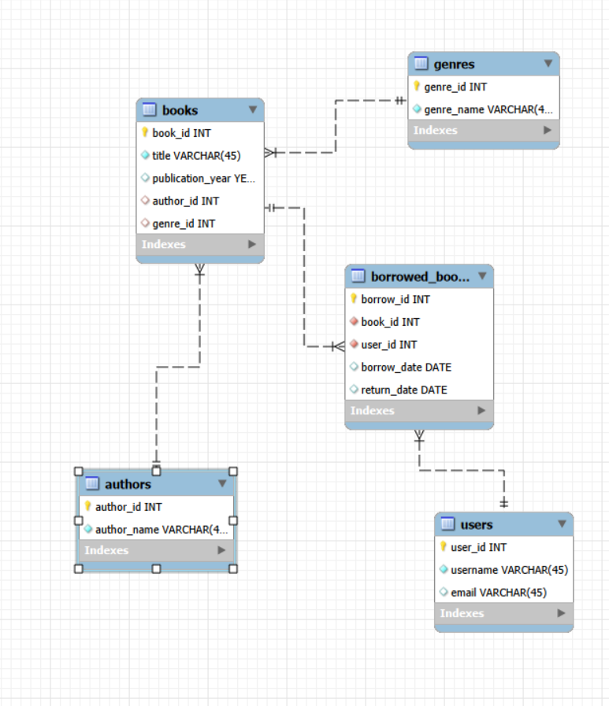
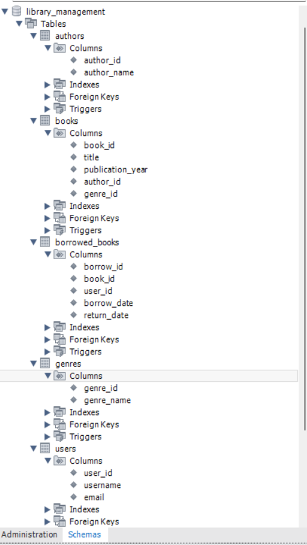

---

## Task 2

Insert test data into all created tables.

### SQL code

```sql
-- Task 2
USE library_management;

INSERT INTO authors (author_name)
VALUES
    ('George Orwell'),
    ('J.K. Rowling');

INSERT INTO genres (genre_name)
VALUES
    ('Dystopian'),
    ('Fantasy');

INSERT INTO users (username, email)
VALUES
    ('ivan_petrenko', 'ivan.petrenko@example.com'),
    ('olena_shevchenko', 'olena.shevchenko@example.com');

INSERT INTO books (title, publication_year, author_id, genre_id)
VALUES
    ('1984', 1949, 1, 1),
    ('Harry Potter and the Philosopher''s Stone', 1997, 2, 2);

INSERT INTO borrowed_books (book_id, user_id, borrow_date, return_date)
VALUES
    (1, 1, '2024-01-10', '2024-01-20'),
    (2, 2, '2024-02-05', '2024-02-19');
```

### Screenshots

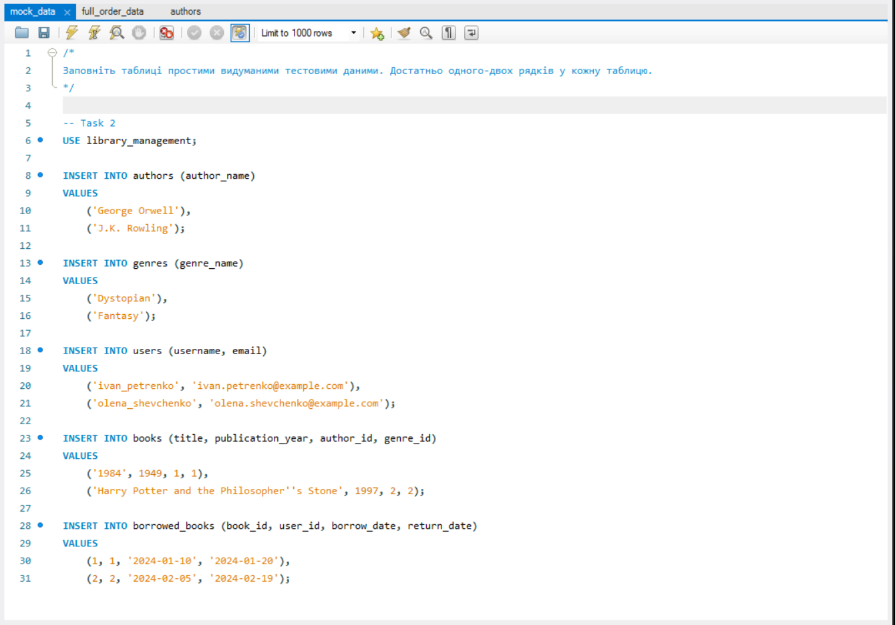
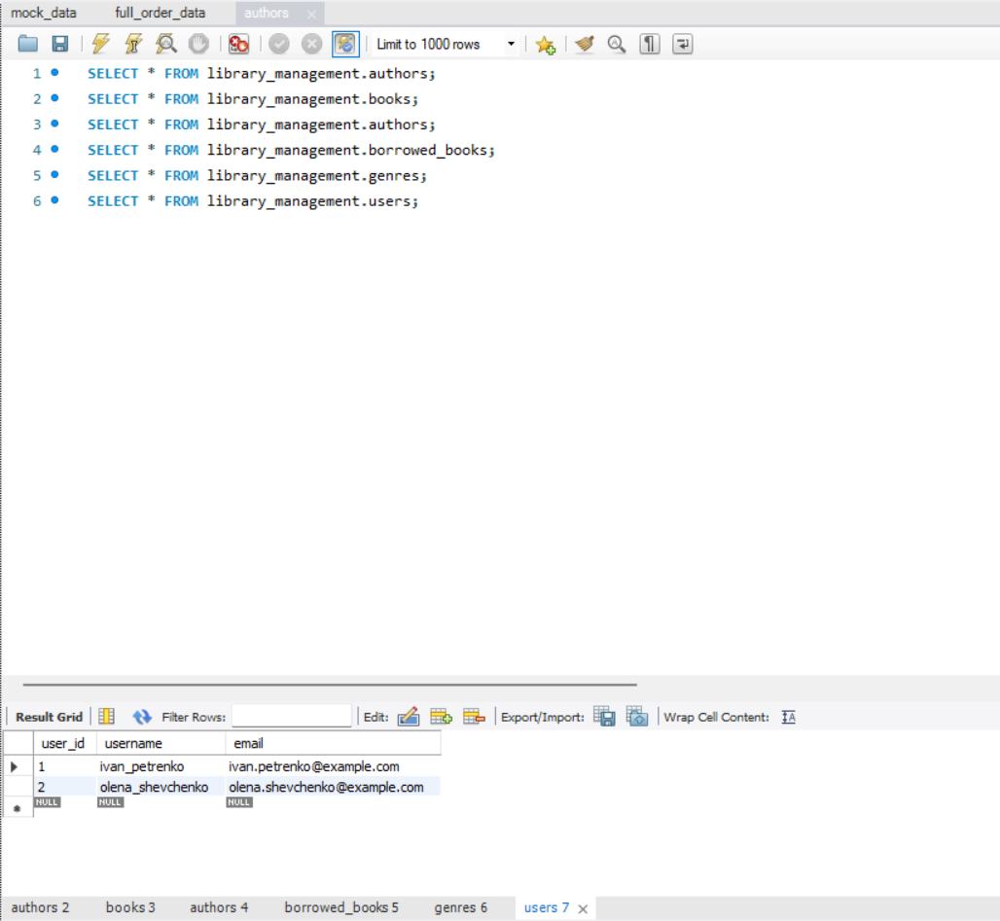

---

## Task 3

Write a query using `FROM` and `INNER JOIN` that joins all tables from the previous database:

* `order_details`
* `orders`
* `customers`
* `products`
* `categories`
* `employees`
* `shippers`
* `suppliers`

### SQL code

```sql
-- Task 3
USE `goit-rdb-hw-03`;

SELECT *
FROM
    order_details AS od
INNER JOIN
    orders AS o
    ON od.order_id = o.id
    INNER JOIN
        customers AS c
        ON o.customer_id = c.id
    INNER JOIN
        employees AS e
        ON o.employee_id = e.employee_id
    INNER JOIN
        shippers AS sh
        ON o.shipper_id = sh.id
INNER JOIN
    products AS p
    ON od.product_id = p.id
    INNER JOIN
        suppliers AS sp
        ON p.supplier_id = sp.id
    INNER JOIN
        categories AS cg
        ON p.category_id = cg.id;
```

### Screenshot

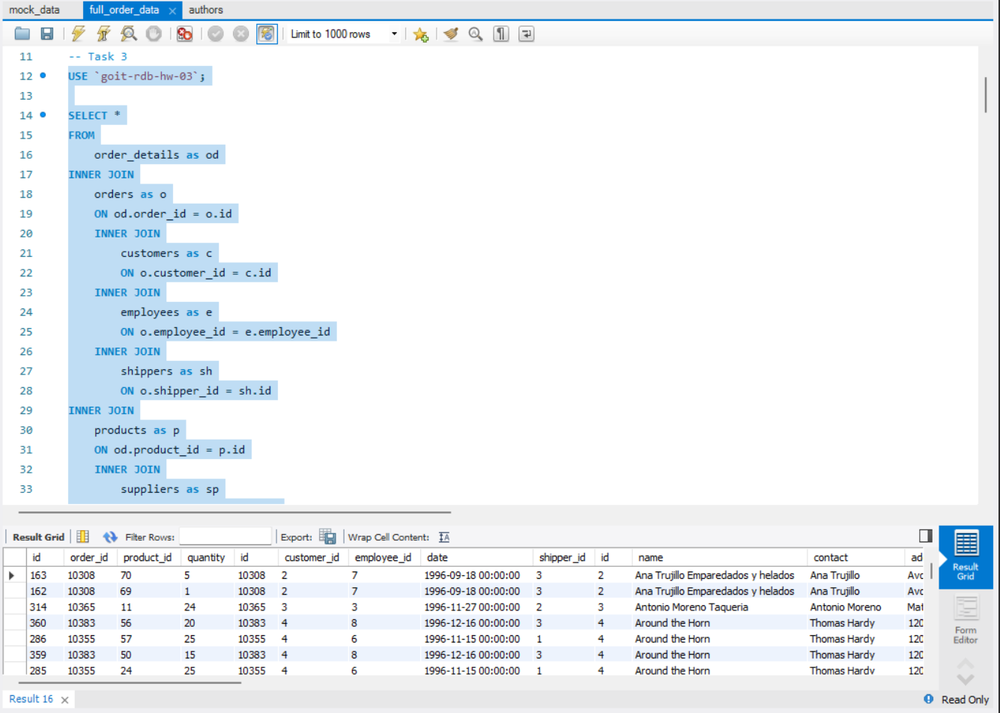

---

## Task 4.1

Determine how many rows were returned.

### SQL code

```sql
-- Task 4.1
SELECT SUM(1) AS row_count
FROM
    order_details AS od
INNER JOIN
    orders AS o
    ON od.order_id = o.id
    INNER JOIN
        customers AS c
        ON o.customer_id = c.id
    INNER JOIN
        employees AS e
        ON o.employee_id = e.employee_id
    INNER JOIN
        shippers AS sh
        ON o.shipper_id = sh.id
INNER JOIN
    products AS p
    ON od.product_id = p.id
    INNER JOIN
        suppliers AS sp
        ON p.supplier_id = sp.id
    INNER JOIN
        categories AS cg
        ON p.category_id = cg.id;
```

### Screenshot

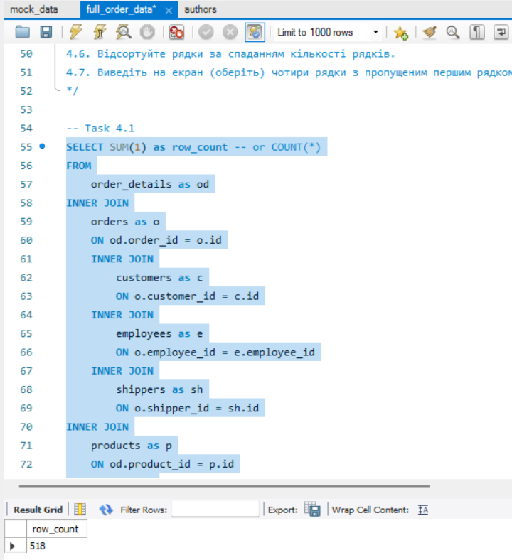

---

## Task 4.2

Replace several `INNER JOIN` operators with `LEFT JOIN` and compare the number of rows.

### SQL code

```sql
-- Task 4.2
SELECT SUM(1) AS row_count
FROM
    order_details AS od
LEFT JOIN
    orders AS o
    ON od.order_id = o.id
    INNER JOIN
        customers AS c
        ON o.customer_id = c.id
    INNER JOIN
        employees AS e
        ON o.employee_id = e.employee_id
    INNER JOIN
        shippers AS sh
        ON o.shipper_id = sh.id
LEFT JOIN
    products AS p
    ON od.product_id = p.id
    INNER JOIN
        suppliers AS sp
        ON p.supplier_id = sp.id
    INNER JOIN
        categories AS cg
        ON p.category_id = cg.id;
```

### Result explanation

After replacing some `INNER JOIN` operators with `LEFT JOIN`, the number of rows did not change.

This happened because the related records exist in the joined tables, so `LEFT JOIN` produced the same result as the original query in this case.

### Screenshot

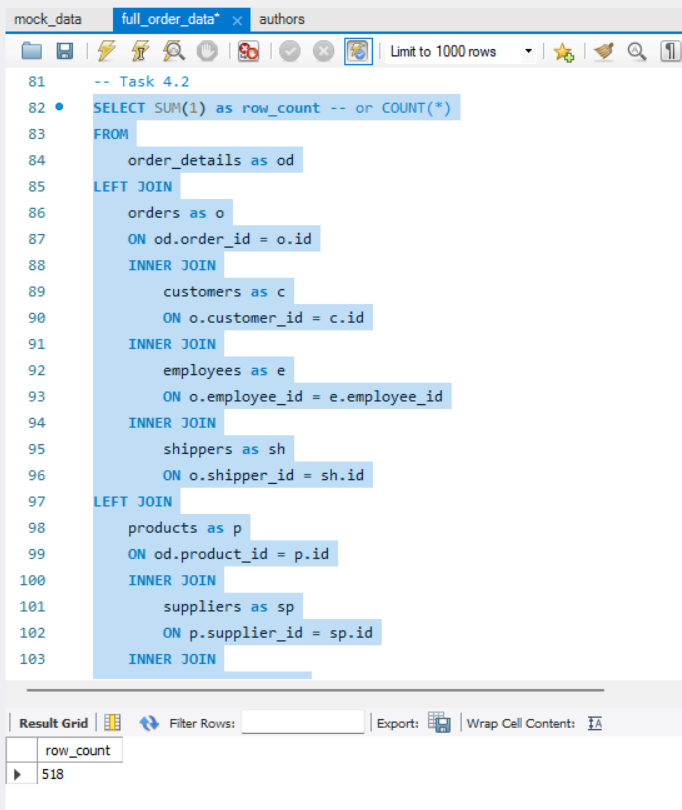

---

## Task 4.3

Select only rows where `employee_id > 3` and `employee_id <= 10`.

### SQL code

```sql
-- Task 4.3
SELECT *
FROM
    order_details AS od
INNER JOIN
    orders AS o
    ON od.order_id = o.id
    INNER JOIN
        customers AS c
        ON o.customer_id = c.id
    INNER JOIN
        employees AS e
        ON o.employee_id = e.employee_id
    INNER JOIN
        shippers AS sh
        ON o.shipper_id = sh.id
INNER JOIN
    products AS p
    ON od.product_id = p.id
    INNER JOIN
        suppliers AS sp
        ON p.supplier_id = sp.id
    INNER JOIN
        categories AS cg
        ON p.category_id = cg.id
WHERE
    o.employee_id > 3 AND o.employee_id <= 10;
```

### Screenshot

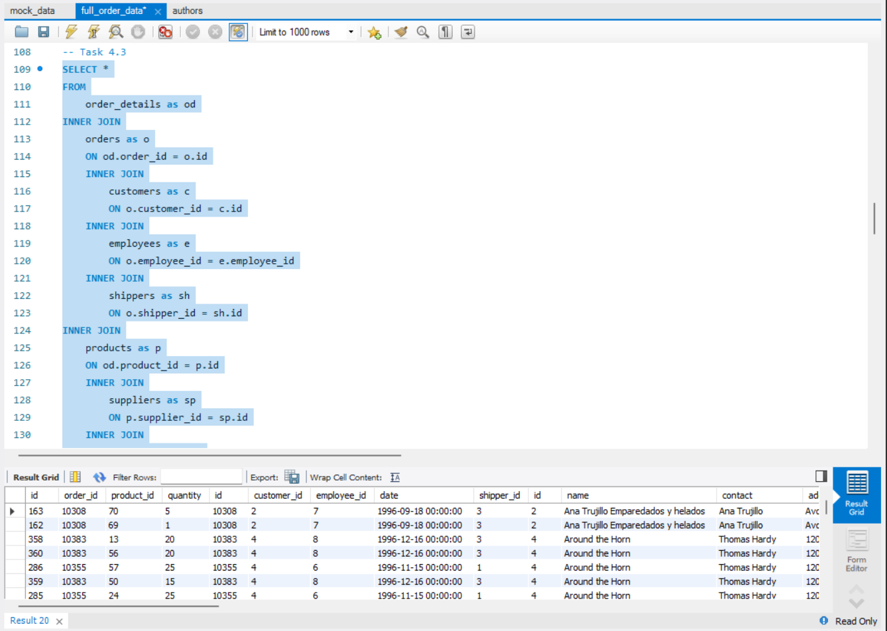

---

## Task 4.4

Group by category name, count the number of rows in each group, and calculate the average quantity of products.

### SQL code

```sql
-- Task 4.4
SELECT
    cg.name AS category_name,
    COUNT(od.id) AS row_count,
    AVG(od.quantity) AS avg_qty
FROM
    order_details AS od
INNER JOIN
    orders AS o
    ON od.order_id = o.id
    INNER JOIN
        customers AS c
        ON o.customer_id = c.id
    INNER JOIN
        employees AS e
        ON o.employee_id = e.employee_id
    INNER JOIN
        shippers AS sh
        ON o.shipper_id = sh.id
INNER JOIN
    products AS p
    ON od.product_id = p.id
    INNER JOIN
        suppliers AS sp
        ON p.supplier_id = sp.id
    INNER JOIN
        categories AS cg
        ON p.category_id = cg.id
WHERE
    o.employee_id > 3 AND o.employee_id <= 10
GROUP BY
    cg.name;
```

### Screenshot

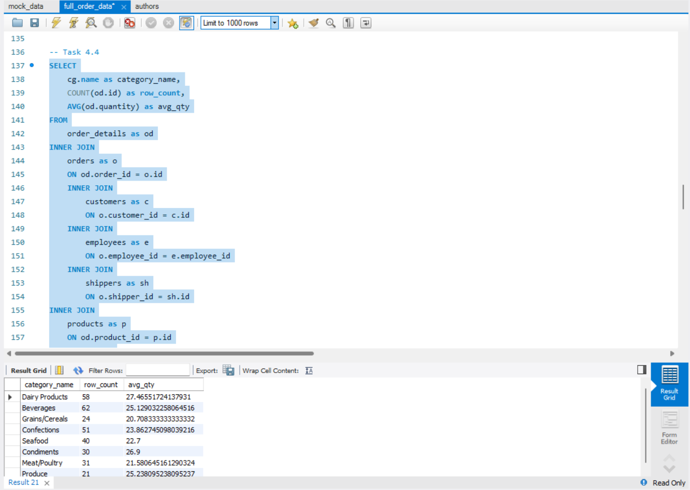

---

## Task 4.5

Filter rows where the average quantity of products is greater than 21.

### SQL code

```sql
-- Task 4.5
SELECT
    cg.name AS category_name,
    COUNT(od.id) AS row_count,
    AVG(od.quantity) AS avg_qty
FROM
    order_details AS od
INNER JOIN
    orders AS o
    ON od.order_id = o.id
    INNER JOIN
        customers AS c
        ON o.customer_id = c.id
    INNER JOIN
        employees AS e
        ON o.employee_id = e.employee_id
    INNER JOIN
        shippers AS sh
        ON o.shipper_id = sh.id
INNER JOIN
    products AS p
    ON od.product_id = p.id
    INNER JOIN
        suppliers AS sp
        ON p.supplier_id = sp.id
    INNER JOIN
        categories AS cg
        ON p.category_id = cg.id
WHERE
    o.employee_id > 3 AND o.employee_id <= 10
GROUP BY
    cg.name
HAVING
    AVG(od.quantity) > 21;
```

### Screenshot

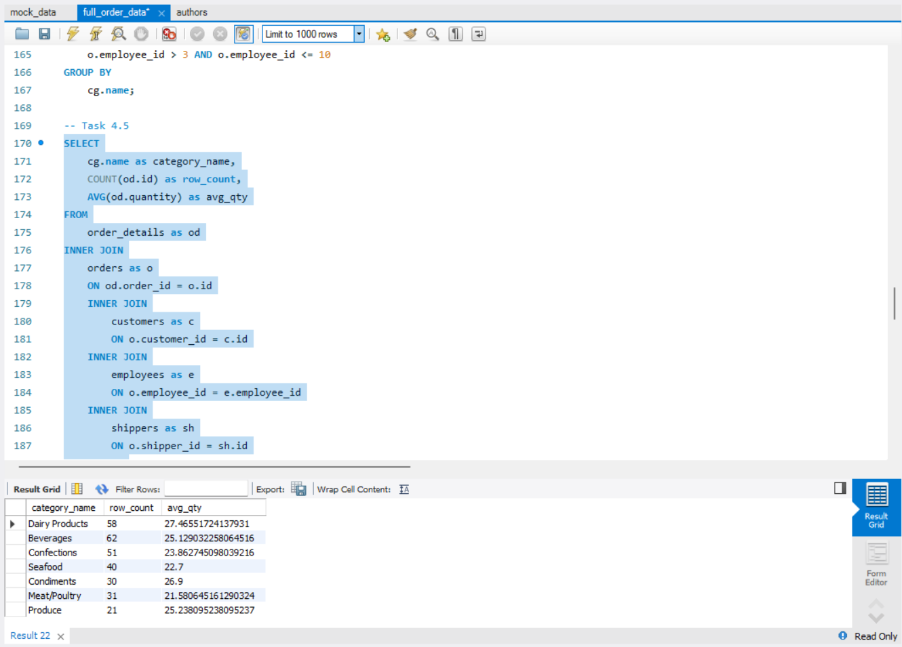

---

## Task 4.6

Sort rows by row count in descending order.

### SQL code

```sql
-- Task 4.6
SELECT
    cg.name AS category_name,
    COUNT(od.id) AS row_count,
    AVG(od.quantity) AS avg_qty
FROM
    order_details AS od
INNER JOIN
    orders AS o
    ON od.order_id = o.id
    INNER JOIN
        customers AS c
        ON o.customer_id = c.id
    INNER JOIN
        employees AS e
        ON o.employee_id = e.employee_id
    INNER JOIN
        shippers AS sh
        ON o.shipper_id = sh.id
INNER JOIN
    products AS p
    ON od.product_id = p.id
    INNER JOIN
        suppliers AS sp
        ON p.supplier_id = sp.id
    INNER JOIN
        categories AS cg
        ON p.category_id = cg.id
WHERE
    o.employee_id > 3 AND o.employee_id <= 10
GROUP BY
    cg.name
HAVING
    AVG(od.quantity) > 21
ORDER BY
    row_count DESC;
```

### Screenshot

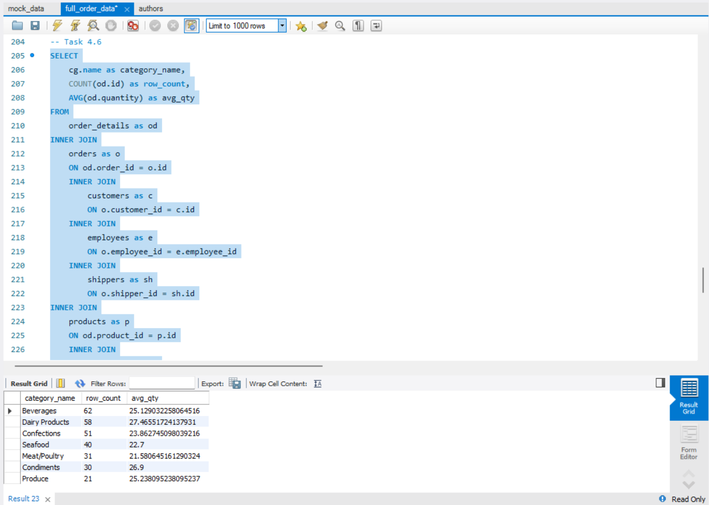

---

## Task 4.7

Display four rows while skipping the first row.

### SQL code

```sql
-- Task 4.7
SELECT
    cg.name AS category_name,
    COUNT(od.id) AS row_count,
    AVG(od.quantity) AS avg_qty
FROM
    order_details AS od
INNER JOIN
    orders AS o
    ON od.order_id = o.id
    INNER JOIN
        customers AS c
        ON o.customer_id = c.id
    INNER JOIN
        employees AS e
        ON o.employee_id = e.employee_id
    INNER JOIN
        shippers AS sh
        ON o.shipper_id = sh.id
INNER JOIN
    products AS p
    ON od.product_id = p.id
    INNER JOIN
        suppliers AS sp
        ON p.supplier_id = sp.id
    INNER JOIN
        categories AS cg
        ON p.category_id = cg.id
WHERE
    o.employee_id > 3 AND o.employee_id <= 10
GROUP BY
    cg.name
HAVING
    AVG(od.quantity) > 21
ORDER BY
    row_count DESC
LIMIT 4 OFFSET 1;
```

### Screenshot

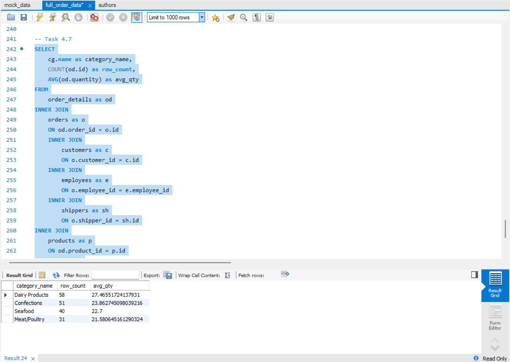

---

## Conclusion

All queries were executed and verified in MySQL Workbench.
